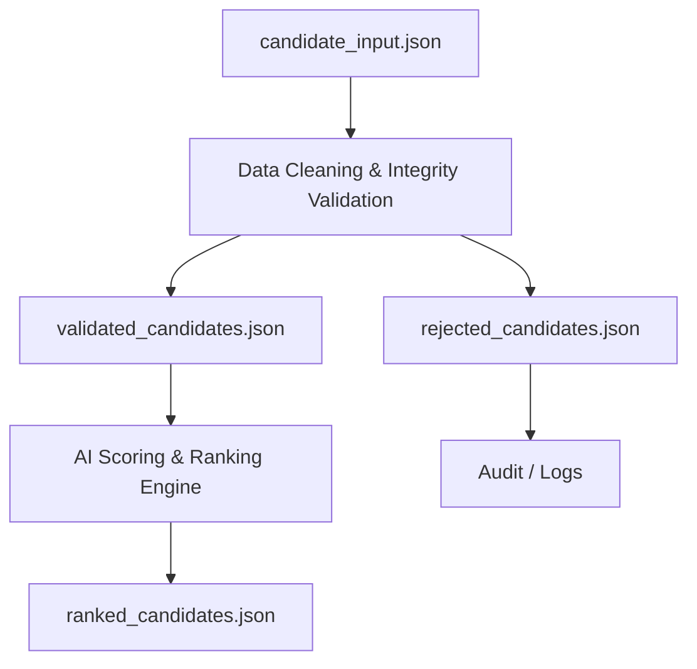
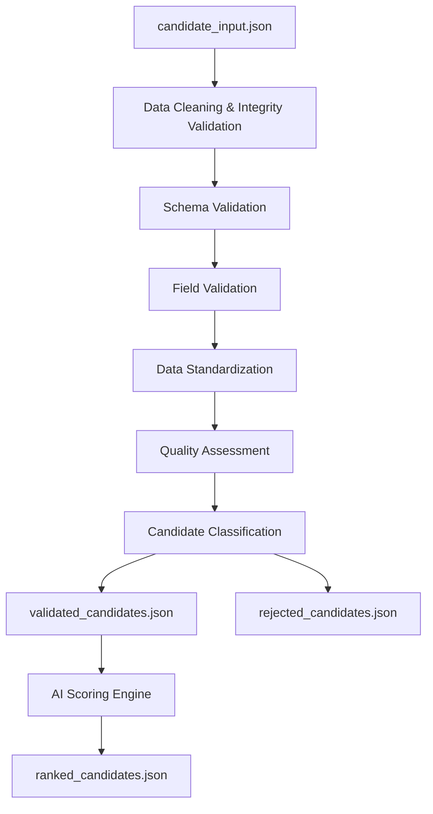

# Data Cleaning & Integrity Validation Pipeline

## Objective:-
The purpose of this module is to validate, clean, and standardize candidate data before it enters the AI scoring engine. The module should ensure that only reliable candidate profiles are considered for ranking while preserving rejected records for auditing and future review.

## Pipeline Architecture

# Step 1 – Input Validation
## Objective:- Ensure the uploaded JSON file is valid before processing.

Validation:-

- JSON file is readable
- JSON syntax is valid
- Required root objects exist
- Arrays are correctly formatted

Required Sections:-
- candidate_id
- profile
- career_history
- education
- skills
- redrob_signals

Action:- 
- Invalid JSON → Reject record
- Missing mandatory objects → Reject record

# Step 2 – Field Validation

Validate the values inside every section.

## 1. Profile Validation

Verify:

- Candidate ID exists
- Years of experience is numeric
- Experience is within realistic range
- Current title exists
- Location exists
- Country exists

## 2. Career History Validation

Verify:

- Valid start date
- Valid end date
- Start date ≤ End date
- Only one current job
- Duration is consistent with dates

## 3. Education Validation

Verify:

- Institution exists
- Degree exists
- Start year < End year
- Graduation year is valid

## 4. Skills Validation

Verify:

- Skill name exists
- Remove duplicate skills
- Ignore empty skill entries

## 5. Redrob Signals Validation

Verify:

- Required metrics exist
- Numeric fields contain numeric values
- Boolean fields contain valid boolean values

# Step 3 – Data Standardization
Normalize inconsistent values without changing their meaning.

## Standardize
### 1. Locations
Example:-Bombay
         Mumbai
         Mumbai, India
         ↓
         Mumbai

### 2. Countries
Example:- US
          USA
          United States
          ↓
          United States

### 3. Skills
Example:- python
          PYTHON
          Python
          ↓
          Python

### 4. Job Titles
Example:- SDE
          Software Developer
          Software Engineer
          ↓
          Normalize to a common title

### 5. Dates
Convert every date into:- YYYY-MM-DD

# Step 4 – Data Quality Assessment
Every candidate starts with
Quality Score = 100
Points are deducted for integrity issues.

## Suggested Penalties
| Issue                  | Penalty |
| ---------------------- | ------- |
| Missing Profile        | -50     |
| Missing Skills         | -25     |
| Invalid Experience     | -20     |
| Invalid Career Dates   | -20     |
| Duplicate Skills       | -5      |
| Missing Education      | -10     |
| Missing Redrob Signals | -10     |
| Missing Current Title  | -15     |

## Note: Penalty values should be configurable rather than hard-coded so they can be adjusted over time.

# Step 5 – Candidate Classification
Based on the final quality score:
| Quality Score | Status       | Output                                           |
| ------------- | ------------ | ------------------------------------------------ |
| 80–100        | Accepted     | validated_candidates.json                        |
| 50–79         | Needs Review | validated_candidates.json *(flagged for review)* |
| Below 50      | Rejected     | rejected_candidates.json                         |

This approach keeps potentially useful candidates available for manual review while preventing poor-quality data from influencing the ranking results.

# Step 6 – Output Files
## validated_candidates.json

Contains candidates that successfully passed the validation pipeline and are ready for AI scoring.
Example:-

- candidate_id
- profile
- career_history
- education
- skills
- redrob_signals
- data_quality

Additional metadata:-

- Quality Score
- Status
- Warnings
This file becomes the direct input to the AI Scoring Engine.

## rejected_candidates.json

Contains candidates removed from the ranking process.

Each rejected record should include:

- Candidate ID
- Quality Score
- Rejection Status
- List of validation failures

Example:-
Candidate ID

Status : Rejected

Reasons

- Missing Profile
- Invalid Experience
- Corrupted Career History

This file is stored only for audit and debugging purposes.

## Final Pipeline

# Design Principles

- Modular: Each stage has a single responsibility, making the pipeline easier to maintain.
- Configurable: Validation rules and penalty weights should be externalized so they can be updated without modifying the pipeline.
- Transparent: Every rejected or flagged candidate should include the reasons for its classification.
- Non-destructive: The original input file remains unchanged. The pipeline generates separate validated and rejected outputs, ensuring traceability and simplifying debugging.