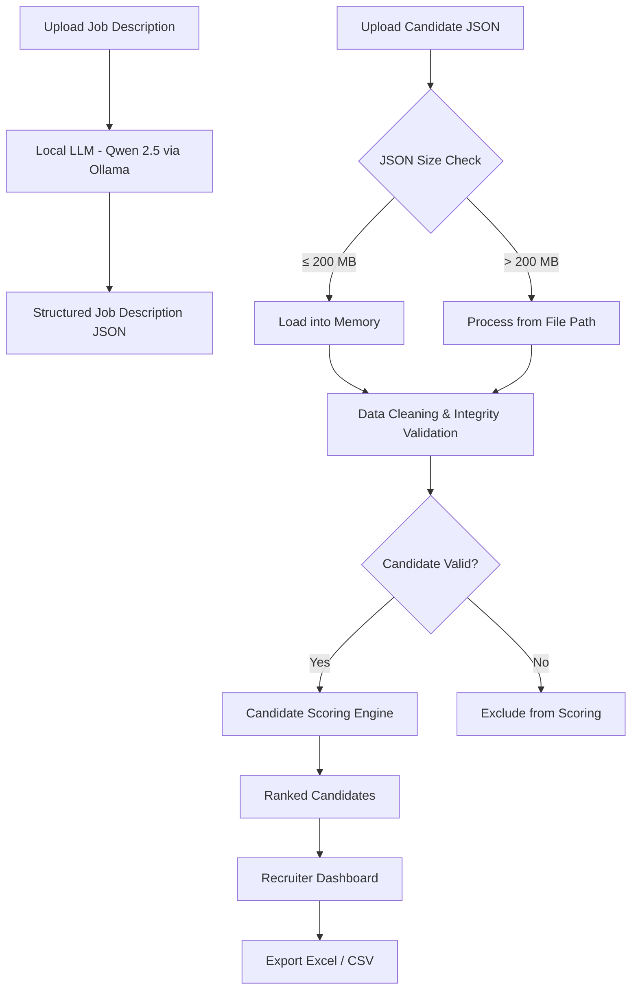

# HR AI – Intelligent AI Recruitment System

> An AI-powered recruitment platform that streamlines the hiring workflow by automating Job Description parsing, candidate validation, intelligent scoring, and recruiter decision-making using a **local Large Language Model (Qwen 2.5 via Ollama)**.

---

# Features

- 🤖 Offline AI-powered Job Description Parsing using Qwen 2.5
- 📄 Upload Job Description (PDF / DOCX / TXT / Paste Text)
- 🧠 Automatic extraction of Role, Skills, Experience, Location, and hiring requirements
- 📁 Candidate JSON Upload
- 📦 Automatic handling of large candidate datasets (>200 MB)
- 🧹 Data Cleaning & Integrity Validation
- 🏆 AI-assisted Candidate Scoring Engine
- 📊 Recruiter Dashboard
- 📤 Export Ranked Candidates (Excel / CSV)

---

# System Pipeline



# Installation

## 1. Clone the Repository

```bash
git clone <repository-url>
cd HR_AI
```

---

## 2. Create a Virtual Environment

### Windows

```bash
python -m venv .venv
.venv\Scripts\activate
```

### Linux / macOS

```bash
python3 -m venv .venv
source .venv/bin/activate
```

---

## 3. Install Dependencies

```bash
pip install -r requirements.txt
```

---

# Local LLM Setup (Ollama)

The application performs Job Description parsing using **Qwen 2.5** running locally through **Ollama**.

This allows the project to work completely offline after the model has been downloaded.

---

## Step 1 – Install Ollama

Download Ollama:

https://ollama.com/download

Verify installation:

```bash
ollama --version
```

---

## Step 2 – Download the Local Model

```bash
ollama pull qwen2.5:1.5b
```

---

## Step 3 – Verify Installation

```bash
ollama list
```

Expected Output

```text
qwen2.5:1.5b
```

---

## Step 4 – Start Ollama

If the Ollama service is not already running:

```bash
ollama serve
```

(Optional test)

```bash
ollama run qwen2.5:1.5b
```

---

# Configuration

The application is designed to run **completely offline** using **Qwen 2.5 via Ollama**.

Although the interface provides fields for external AI API keys (such as Gemini), **they are optional and are not required for the current implementation**.

The local Ollama model handles Job Description parsing by default.

The external provider configuration has been retained only to support future extensibility and fallback mechanisms.

---

# Running the Application

```bash
streamlit run app.py
```

---

# Job Description Parsing

Uploaded Job Descriptions are processed locally using **Qwen 2.5**.

The parser extracts structured hiring information including:

- Job Title
- Required Skills
- Preferred Skills
- Experience Range
- Location
- Employment Type
- Education Requirements
- Additional Hiring Requirements

The extracted information is converted into a structured JSON format and used throughout the recruitment workflow.

---

# Candidate Processing

Candidates are uploaded as a structured JSON dataset.

The application automatically determines how the uploaded dataset should be processed.

### JSON ≤ 200 MB

The complete dataset is loaded directly into memory.

### JSON > 200 MB

Instead of loading the complete dataset into RAM, the application processes candidates directly from the uploaded file path.

This significantly reduces memory usage while supporting very large candidate datasets.

---

# Data Cleaning & Integrity Validation

Before entering the scoring pipeline, every candidate profile undergoes integrity validation to ensure data quality and consistency.

## Profile Validation

- Candidate ID validation
- Experience validation
- Current designation validation
- Location validation
- Country validation

---

## Career History Validation

- Valid employment dates
- Start date ≤ End date
- Only one active employment
- Duration consistency

---

## Education Validation

- Institution present
- Degree present
- Graduation year validation
- Education timeline consistency

---

## Skills Validation

- Remove duplicate skills
- Ignore empty skill entries
- Normalize skill names

---

## Candidate Metadata Validation

- Required fields present
- Numeric field validation
- Boolean field validation
- Missing value handling

---

## Validation Decision

Every uploaded candidate is validated before entering the scoring engine.

### Valid Candidates

- Forwarded directly to the Candidate Scoring Engine.

### Invalid Candidates

- Automatically excluded from scoring and ranking.

This ensures that only high-quality and reliable candidate profiles participate in the final ranking process.

---

# Candidate Scoring Engine

Validated candidates are ranked using multiple evaluation parameters, including:

- Skill Match
- Role Match
- Experience Match
- Candidate Metadata
- Profile Quality Signals

The scoring engine produces a ranked list of candidates for recruiter review.

---

# Recruiter Dashboard

The recruiter dashboard provides:

- Candidate Rankings
- Candidate Search
- Candidate Details
- Score Comparison
- Export Options

---

# Export

The application supports exporting ranked candidates in:

- Excel (.xlsx)
- CSV (.csv)

These exports can be used directly for recruiter review and further hiring workflows.

---

# Technologies Used

- Python
- Streamlit
- Ollama
- Qwen 2.5
- Pandas
- OpenPyXL
- JSON
- Pydantic

---

# Future Scope / In Progress

The following enhancements are planned for future releases:

- 💬 AI Recruiter Chatbot
- 🔗 LinkedIn Profile URL Integration
- 📧 Automated Email Outreach
- 🤖 Multi-LLM Support
- 🔄 OpenRouter Fallback for local model redundancy
- 📝 Resume Summarization
- 📅 Automated Interview Scheduling
- 📈 Recruiter Analytics Dashboard
- 🎯 Candidate Recommendation Engine

---

# Notes

- The application is optimized to run completely offline after the Ollama model has been downloaded.
- Candidate processing expects JSON input following the required schema.
- Large candidate datasets (>200 MB) are processed using a file-path-based workflow to reduce memory consumption.
- External AI providers are optional and are included only for future extensibility and fallback support.
- No external API keys are required for the current implementation.

---

